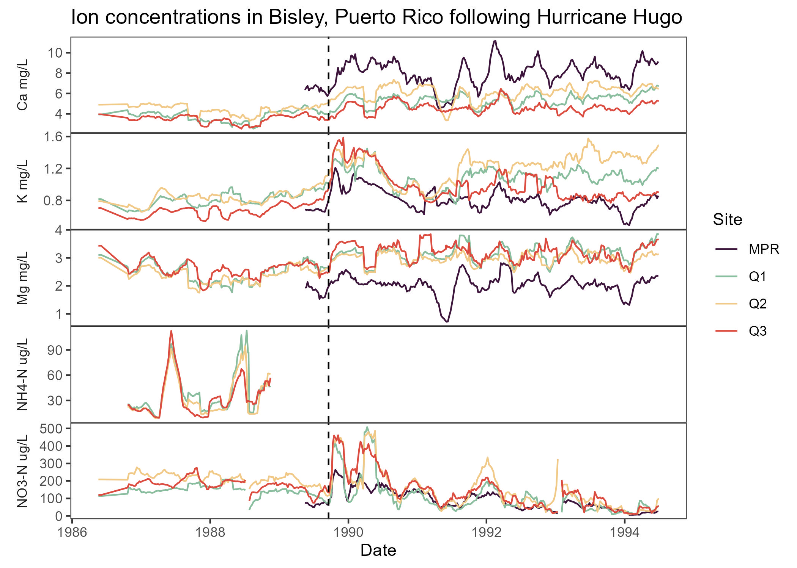

# EDS 214: Reproducible Workflow

## Background
This repository contains the code for the EDS 214 class project on reproducible workflows. This project is based on the paper by Schaefer et. al. 2000, assessing the effects of hurricane disturbance on stream water concentrations in the forest watersheds of Puerto Rico. We are reproducing figure 3 from the paper and documenting our workflow.

This work is done by Leela Dixit, in collaboration with Max Czapanskiy, Alessandra Vidal Meza, with help from the students of MEDS 2026.

## Contents
### 1) Data
- [:file\_folder: data](https://github.com/lsdixit/eds214-reproducible-workflow/tree/main/data): raw data for all 4 sites sampled and used in reproduced figure.

### 2) Supporting Code
[02_data-cleaning.R](https://github.com/lsdixit/eds214-reproducible-workflow/blob/main/02_data-cleaning.R) This script contains the loading and all combining and modifying of the 4 raw data files. 

- [:file\_folder: R](https://github.com/lsdixit/eds214-reproducible-workflow/tree/main/R): R scripts containing functions for 9 week moving average and plots.

### 3) Figures
- [:file\_folder: figs](https://github.com/lsdixit/eds214-reproducible-workflow/tree/main/figs): final reproduced plot saved as a .jpg.

### 4) Outputs
- [:file\_folder: output](https://github.com/lsdixit/eds214-reproducible-workflow/tree/main/output): clean data following tidy, wrangling, and 9 week moving average calculation. These data were used in creation of the figure 3 plot.

- [:file\_folder: paper](https://github.com/lsdixit/eds214-reproducible-workflow/tree/main/paper): Quarto document of full project description, methods, and results.

## Workflow

Simplified flowchart documenting the general workflow the authors took to produce figure 3. 

We began by reading in the four data files and cleaning them by removing unneeded columns and changing names to snake case. The 9 week moving average function was then applied to each of the data files individually, followed by all four data frames being combined into one. Ion concentrations were pivoted to long format during that combination for ease in creating our figure. The plotting function was applied to this long combined data frame to produce the figure. 